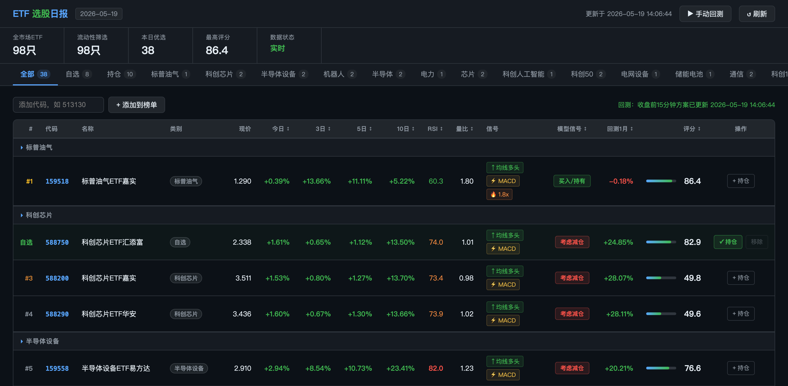

# ETF Investing

纯 AI 开发的一个面向 A 股 ETF 的中短线选股与持仓监控工具。项目会按 mootdx、FUTU OpenD、腾讯财经、东方财富的顺序获取标的池、历史 K 线和实时行情，然后用动量、量能、技术面、趋势等多因子模型生成 ETF 排名；同时提供命令行日报、Web Dashboard、独立实时行情 API 服务。

> 风险提示：本项目输出仅用于量化研究和投资参考，不构成任何投资建议。ETF 交易存在市场风险，请自行决策并控制仓位。

## 屏幕截图


## 主要功能

- 全市场 ETF 扫描：按 mootdx、FUTU OpenD、东方财富顺序拉取 ETF 列表，并按成交额过滤低流动性品种。
- 多数据源行情：
  - 历史日 K：mootdx → FUTU OpenD → 腾讯财经 → 东方财富。
  - 实时行情：mootdx → FUTU OpenD → 腾讯财经 → 东方财富。
- 多因子选股：基于动量、量能、技术、趋势四类因子综合评分。
- 风险硬过滤：过滤 RSI 过热、短期大跌、跌破 MA20 且持续走弱的标的。
- 命令行报告：一键生成每日 ETF 优选榜。
- Web Dashboard：浏览全市场优选结果、核心 Tab 快速切换，其他分类通过下拉选择，支持手动刷新。
- 持仓监控：保存关注/持仓 ETF，实时查看行情和卖出参考信号；每次刷新会标记模型信号/卖出信号的前后变动，并通过飞书机器人发送提醒；自动刷新仅在交易日盘中运行，收盘后和节假日自动暂停。
- 独立行情服务：提供 `/quote`、`/intraday`、`/intraday/futu` 与 `/health` API，方便其他本地工具调用。
- 本地分钟行情库：独立服务提供 `/intraday`、`/backfill/today`、`/logs`，默认落地 5 分钟分时；回填脚本会合并全部榜单、自选列表、持仓列表和硬过滤后的全市场 ETF 池，并优先用 FUTU OpenAPI 回溯 30 天历史 5 分钟分时落库。
- 一键部署：提供 venv 本地一键部署脚本、本地重启脚本和 Docker 一键部署脚本。

## 技术栈

- Python 3
- Flask / flask-cors：本地 Web 服务与 API
- pandas / numpy：K 线数据处理、指标与因子计算
- requests：HTTP 数据源请求
- mootdx：通达信行情协议数据源
- akshare：保留历史兼容测试；当前回测买卖点优先使用本地行情库 / FUTU 分时数据
- futu-api：FUTU OpenD 本地行情接口，用于当天/历史分钟分时兜底

依赖见 `requirements.txt`：

```txt
flask
flask-cors
mootdx
requests
pandas
numpy
akshare
futu-api
```

## 运行环境与网络要求

### Python 运行环境

当前开发机环境：

- 操作系统：macOS
- Python版本：Python 3.13.0

推荐运行方式：

```bash
cd etf-investing
source .venv/bin/activate
python --version
python etf_daily.py
python etf_web.py
python etf_server.py
```

如果重新创建虚拟环境，建议使用 Python 3.10+；当前项目已在 Python 3.13.0 虚拟环境下运行和测试。

### 本地端口要求

项目默认启动三个本地服务，端口由 `config.json` 的 `server` 配置控制：

| 端口 | 服务 | 默认地址 | 说明 |
| ---: | --- | --- | --- |
| 8080 | Web Dashboard | `http://localhost:8080` | 浏览器访问的 ETF 选股页面 |
| 5678 | 实时行情 API | `http://localhost:5678` | `/quote`、`/intraday`、`/intraday/futu`、`/health` 本地接口 |
| 5680 | 本地分钟行情库 API | `http://localhost:5680` | `/intraday`、`/backfill/today`、`/logs`，SQLite 落库 |

默认监听地址是 `0.0.0.0`。如果只在本机使用，可以改为 `127.0.0.1` 后重启服务；如果需要局域网其他设备访问，需要确保本机防火墙允许对应端口入站。

### 对外请求与网络通信要求

项目需要访问外部行情数据源，请确保运行机器可以进行 DNS 解析，并允许以下出站连接：

| 数据源 | 用途 | 协议/端口 | 地址 |
| --- | --- | --- | --- |
| 东方财富 | 获取全市场 ETF 列表、代码、名称、成交额 | HTTPS 443 | `push2.eastmoney.com` |
| 腾讯财经历史 K 线 | 获取 ETF 前复权日 K 数据 | HTTPS 443 | `web.ifzq.gtimg.cn` |
| 腾讯财经实时行情 | 获取 ETF 实时价格、涨跌幅、成交额等 | HTTPS 443 | `qt.gtimg.cn` |
| 通达信 / mootdx | 实时行情主数据源、历史 K 线备用数据源 | TCP，常见端口 7709 / 7719 / 7720 | mootdx 自动选择的通达信行情服务器 IP |

网络注意事项：

- 全市场扫描会并发拉取历史 K 线，默认并发数为 `selection.history_workers = 10`；网络较慢或接口限流时可在 `config.json` 中调低。
- 实时行情批量请求默认每批 `selection.realtime_batch_size = 80` 个代码，过大可能导致腾讯接口 URL 过长。
- 外部 HTTP 请求超时配置位于 `network.timeouts`：东方财富 15 秒、腾讯历史 K 线 10 秒、腾讯实时行情 8 秒。
- 如果 mootdx 初始化失败、TCP 行情线路不可达，程序会自动降级使用腾讯财经 HTTP 接口；但如果 HTTPS 出站也被拦截，选股和持仓实时行情都可能为空或加载失败。
- 如运行环境需要代理，请确保 Python `requests` 能读取 `HTTP_PROXY` / `HTTPS_PROXY` / `NO_PROXY` 等环境变量，并且不要把 `localhost` / `127.0.0.1` 代理到外部。
- 项目不需要公网入站访问；除非你要从其他设备访问 Web Dashboard，否则只需要允许本机出站访问上述数据源。

## 项目结构

```text
etf-investing/
├── src/
│   └── etf_investing/       # 业务源码包
│       ├── __init__.py
│       ├── config.py        # 集中配置加载模块，读取项目根目录 config.json + 不入库的 config.local.json
│       ├── daily.py         # 命令行 ETF 每日选股报告实现
│       ├── data.py          # 历史 K 线与实时行情数据获取层
│       ├── market_data.py    # SQLite 本地分钟行情库、东方财富/FUTU 数据源切换、请求日志
│       ├── market_data_service.py # 本地行情库 API 服务
│       ├── pool.py          # 静态 ETF 候选池，作为全市场接口失败时的降级数据
│       ├── server.py        # 独立实时行情 API 服务实现
│       ├── strategy.py      # 技术指标、选股模型、卖出信号模型
│       ├── universe.py      # 全市场 ETF 列表获取、分类、流动性过滤与缓存
│       └── web_app.py       # Web Dashboard 后端 API + 静态文件服务
├── tests/                   # 单元测试，不与服务级代码同级
│   ├── __init__.py
│   └── test_strategy_models.py
├── etf_daily.py             # 兼容入口：转发到 etf_investing.daily.main
├── etf_web.py               # 兼容入口：转发到 etf_investing.web_app.main
├── etf_server.py            # 兼容入口：转发到 etf_investing.server.main
├── market_data_service.py   # 兼容入口：转发到 etf_investing.market_data_service.main
├── backfill_intraday.py     # 收盘后回填当天分钟行情到 SQLite 行情库
├── venv-deploy.sh           # venv 本地一键部署脚本：建环境、装依赖、重启服务
├── restart.sh               # 本地一键启动/停止/重启脚本
├── docker-deploy.sh         # Docker 一键部署脚本
├── Dockerfile               # Docker 镜像构建文件
├── docker-compose.yml       # Docker Compose 服务编排
├── web/                     # 前端静态资源目录
│   ├── index.html           # Web Dashboard 页面结构
│   └── static/
│       ├── app.css          # Web Dashboard 样式
│       └── app.js           # Web Dashboard 前端逻辑
├── config.json              # URL、端口、模型参数、超时、刷新间隔等公共运行配置
├── config.local.example.json # 每用户私有配置示例；复制为 config.local.json 后填写 FUTU/飞书配置，config.local.json 不入 git
├── pyproject.toml           # Python 包元数据与 src-layout 配置
├── requirements.txt         # Python 依赖
├── holdings.json            # Web Dashboard 持仓/关注列表
└── .universe_cache.json     # 当日 ETF 全市场列表缓存，自动生成/更新
```

## 配置说明

项目运行配置集中在项目根目录的 `config.json`，并可被每用户私有的 `config.local.json` 覆盖；后者已加入 `.gitignore`，用于保存飞书 webhook、FUTU OpenD 地址/端口等不应入库的配置。可以从 `config.local.example.json` 复制生成本地配置。配置由 `src/etf_investing/config.py` 加载。配置文件中以 `_comment` 或 `_comment_xxx` 命名的字段是说明文字，仅用于阅读，不参与业务逻辑。

主要配置分组：

- `urls`：东方财富 ETF 列表接口、腾讯历史 K 线接口、腾讯实时行情接口。
- `headers`：请求外部数据源时使用的 Referer 和 User-Agent。
- `network.timeouts`：外部接口请求超时时间，单位秒。
- `selection`：成交额门槛、扫描数量、历史 K 线天数、并发线程数、评分数量等。
- `models`：模型配置；`active_selection_model` 指定当前选股模型，`active_backtest_scheme` 指定当前回测方案，`active_portfolio_strategy` 指定当前组合策略。默认组合策略为 `eric_c3_rotation`，默认回测方案为 `eric_c3_four_window`，可切回 `legacy_single_symbol` 保留原单标的信号方案。
- `server`：Web Dashboard 端口、独立行情服务端口、本地分钟行情库服务端口、监听地址、行情缓存 TTL、debug 开关。
- `futu`：FUTU OpenD 连接配置，建议放在不入库的 `config.local.json`，例如 `host=127.0.0.1`、`port=11111`；回测和回填会优先使用 FUTU 5 分钟分时，回填脚本默认回溯 30 天历史分时。
- `notifications`：飞书机器人和提醒配置，建议放在 `config.local.json`；`feishu_webhook_url` 为机器人 webhook，消息会以 `QUANT` 开头；`watch_reminder_minute=885` 表示交易日 14:45 发送收盘前 15 分钟看盘提醒。
- `time`：日期、时间戳、报告标题、行情更新时间格式。
- `web`：前端轮询间隔、持仓刷新间隔、交易时段自动刷新窗口；持仓自动刷新会通过交易日历跳过收盘后和节假日/非交易日。

修改 `config.json` 或 `config.local.json` 后需要重启对应服务才能生效。

### 飞书机器人配置

飞书 webhook 属于每个用户/群机器人的私有配置，推荐按下面方式配置：

```bash
cp config.local.example.json config.local.json
```

然后编辑 `config.local.json`：

```json
{
  "futu": {
    "host": "你的 FUTU OpenD 地址",
    "port": 你的 FUTU OpenD 端口
  },
  "notifications": {
    "feishu_webhook_url": "你的飞书机器人webhook",
    "watch_reminder_enabled": true,
    "watch_reminder_minute": 885
  }
}
```

字段说明：

- `notifications.feishu_webhook_url`：飞书群机器人 webhook 地址；为空时不发送飞书消息。
- `notifications.watch_reminder_enabled`：是否启用交易日看盘提醒。
- `notifications.watch_reminder_minute`：当天 0 点后的分钟数；`885` 表示 `14:45`，即 A 股 ETF 收盘前 15 分钟。
- `futu.host` / `futu.port`：FUTU OpenD 连接地址和端口，也放在 `config.local.json` 中，避免把个人环境配置提交到 git。

飞书消息规则：

- 所有飞书文本消息都会自动以 `QUANT` 开头。
- 持仓列表刷新时，如果模型信号或卖出信号文字发生变化，会发送简短变动提醒。
- 每个交易日到达 `watch_reminder_minute` 后只发送一次看盘提醒，状态记录在 `data/notification_state.json`。

配置完成后重启服务：

```bash
./restart.sh restart
./restart.sh status
```

### 本地分钟行情库服务

```bash
# 一键启动会同时启动 5678 实时行情 API、5680 本地行情库 API、8080 Web Dashboard
./restart.sh restart

# 请求分钟行情：优先读本地 SQLite；不传 period 时默认 5 分钟；当天缺失或 refresh=1 时先试 FUTU OpenAPI，空数据再降级东方财富
curl 'http://localhost:5680/intraday?code=513180&days=5'
curl 'http://localhost:5680/intraday?code=513180&period=5&days=5&refresh=1'

# quote 服务中直接用 FUTU OpenAPI 获取当天分时行情
curl 'http://localhost:5678/intraday/futu?code=513180&period=15'
curl 'http://localhost:5678/intraday?code=513180&period=15&source=futu'

# 查看行情库请求日志
curl 'http://localhost:5680/logs?limit=20'

# 收盘后按综合池回填 30 天历史 5 分钟行情到 data/market_data.sqlite3
# 综合池 = 全部榜单 + 自选列表 + 持仓列表 + 硬过滤后的全市场 ETF 池；优先直接用 FUTU 历史分时，自动按 FUTU 频率限制分批等待
.venv/bin/python backfill_intraday.py

# 可以调整榜单数量/回溯天数，默认 top=selection.web_top_n、days=30
.venv/bin/python backfill_intraday.py --top 50 --days 30

# 也可以指定日期段；只传 --start-date 时结束日期默认等于起始日期
.venv/bin/python backfill_intraday.py --start-date 2026-05-18 --end-date 2026-05-20

# 也可以只回填指定代码
.venv/bin/python backfill_intraday.py --codes 513180,513130 --period 5 --start-date 2026-05-18 --end-date 2026-05-20

# 手动按指定日期落库历史 5 分钟分时，--date 省略时默认当天
.venv/bin/python backfill_intraday_date.py --date 2026-05-20
.venv/bin/python backfill_intraday_date.py --codes 513180,513130 --date 2026-05-20
```

FUTU 降级源需要本机已安装 `futu-api` 并启动 FUTU OpenD；连接配置位于 `config.json` / `config.py` 的 `futu.host`、`futu.port`。

## 安装

推荐使用 venv 一键部署脚本：

```bash
cd etf-investing
./venv-deploy.sh
```

脚本会自动创建/更新 `.venv`、安装 `requirements.txt` 和当前项目，并调用 `restart.sh` 重启 5678 实时行情 API、5680 本地行情库 API、8080 Web Dashboard。

常用命令：

```bash
./venv-deploy.sh install    # 只创建/更新 .venv 和依赖，不启动服务
./venv-deploy.sh restart    # 使用现有 .venv 重启服务
./venv-deploy.sh status     # 查看服务状态
./venv-deploy.sh recreate   # 删除并重建 .venv，然后重启服务
```

也可以手动创建虚拟环境：

```bash
cd etf-investing
python3 -m venv .venv
source .venv/bin/activate
pip install -r requirements.txt
```

如果已经存在 `.venv`，可直接激活：

```bash
cd etf-investing
source .venv/bin/activate
```

## 使用方法

### 0. 一键启动/部署

本机 venv 一键部署并启动三个服务：

```bash
./venv-deploy.sh
```

仅重启已有本地服务：

```bash
./restart.sh
```

Docker 一键构建并后台部署：

```bash
./docker-deploy.sh
```

常用 Docker 管理命令：

```bash
./docker-deploy.sh status
./docker-deploy.sh logs
./docker-deploy.sh restart
./docker-deploy.sh stop
```

Docker 部署会启动两个容器：

- `etf-investing-web`：Web Dashboard，端口 `8080`。
- `etf-investing-quote`：实时行情 API，端口 `5678`。

`config.json`、`holdings.json`、`watchlist.json` 会挂载到容器内，方便保留本地配置和持仓/自选列表。

### 1. 命令行生成 ETF 选股日报

```bash
python etf_daily.py
```

常用参数：

```bash
python etf_daily.py --top 5
python etf_daily.py --min-amount 1e8
python etf_daily.py --max-count 200
python etf_daily.py --list
```

参数说明：

- `--top`：展示排名前 N 的 ETF，默认 10。
- `--min-amount`：日成交额门槛，单位元，默认 `5e7`，即 5000 万。
- `--max-count`：按成交额取前 N 只 ETF 进入扫描，默认 300。
- `--list`：只列出今日扫描范围，不运行评分模型。

命令行流程：

1. 获取全市场 ETF 列表。
2. 按成交额筛选高流动性 ETF。
3. 并发获取历史日 K。
4. 获取实时行情。
5. 运行当前启用的选股模型（默认 `multi_factor_v1` 多因子模型）。
6. 输出优选 ETF 报告。

### 2. 启动 Web Dashboard

```bash
python etf_web.py
```

启动后访问：

```text
http://localhost:8080
```

Web Dashboard 采用前后端分离结构：

- 后端：`etf_web.py` 提供 API 和静态文件服务。
- 前端：`web/index.html`、`web/static/app.css`、`web/static/app.js`。
- 前端运行时配置通过 `/api/config` 获取，不再由后端拼接 HTML。

Web Dashboard 提供：

- 今日 ETF 优选排名。
- 分类 Tab 筛选。
- 评分、涨跌幅、RSI、量比、均线/MACD/量能信号展示。
- 手动刷新。
- 持仓/关注按钮。
- 持仓实时行情、传统卖出参考信号、Eric C3 Rotation 出场信号；持仓记录会保存买入价、买入日期、持仓峰值和连续软退出天数。

Web Dashboard 相关 API：

| 方法 | 路径 | 说明 |
| --- | --- | --- |
| GET | `/api/select` | 获取选股结果；若今日缓存不存在，会后台触发扫描 |
| GET | `/api/config` | 获取前端运行时配置，如轮询间隔、自动刷新时间窗口 |
| GET | `/api/market/status` | 获取交易日和自动刷新状态；节假日/收盘后会返回暂停原因 |
| GET | `/api/refresh` | 强制刷新今日选股结果 |
| GET | `/api/holdings` | 获取本地持仓/关注 ETF 代码列表和持仓记录 |
| POST | `/api/holdings/toggle` | 添加或移除某只 ETF，JSON: `{ "code": "513130", "entry_price": 1.234, "entry_date": "2026-05-23" }`；买入字段可选 |
| PATCH | `/api/holdings/<code>` | 更新某只持仓的买入价、买入日期、峰值价或软退出天数 |
| GET | `/api/holdings/realtime` | 获取持仓实时行情、卖出参考信号和 C3 出场信号 |
| POST | `/api/backtest/run` | 手动触发榜单回测，回测在后台线程执行 |
| GET | `/api/backtest/status` | 获取回测状态：`idle` / `running` / `ready` / `error` |
| GET | `/api/strategy` | 获取当前组合策略、可选策略和绑定回测方案 |
| POST | `/api/strategy` | 切换组合策略；切换后会同步绑定回测方案并重新刷新榜单 |
| GET | `/health` | Web Dashboard 健康检查 |

### 3. 启动独立实时行情服务

```bash
python etf_server.py
```

服务地址：

```text
http://localhost:5678
```

接口示例：

```bash
curl 'http://localhost:5678/quote?codes=513130,518850,513100'
curl 'http://localhost:5678/quote?codes=513130&prefer=tencent'
curl 'http://localhost:5678/health'
```

接口说明：

| 方法 | 路径 | 说明 |
| --- | --- | --- |
| GET | `/quote?codes=513130,518850` | 批量获取 ETF 实时行情 |
| GET | `/quote?codes=513130&prefer=tencent` | 强制使用腾讯财经数据源 |
| GET | `/health` | 健康检查，返回 mootdx 可用状态 |

`etf_server.py` 内置 5 秒缓存，避免短时间重复请求相同代码。

## 策略说明

### 数据范围

默认扫描流程使用：

- 标的池优先级：mootdx → FUTU OpenD → 东方财富。
- 过滤货币、债券、理财等不适合短线动量策略的品种。
- 默认选择日成交额不低于 5000 万且成交额靠前的 ETF。
- 若上述列表接口都失败，则降级使用 `etf_pool.py` 中的静态候选池。

### 技术指标

`etf_strategy.py` 会计算：

- MA5 / MA10 / MA20
- RSI(14)
- MACD histogram
- 20 日均量与量比
- 1 日、3 日、5 日、10 日涨跌幅

### 选股模型与多因子评分

当前启用的模型由 `config.json` 中的 `models.active_selection_model` 指定，默认是 `multi_factor_v1`。

默认综合评分权重位于 `models.selection.multi_factor_v1.factor_weights`：

| 因子 | 默认权重 | 说明 |
| --- | ---: | --- |
| 动量因子 | 35% | 3 日与 5 日涨跌幅加权，内部参数在 `momentum` 下配置 |
| 量能因子 | 25% | 量比与短期价格方向协同，内部参数在 `volume` 下配置 |
| 技术因子 | 25% | RSI 健康区间、MACD、均线排列，内部参数在 `technical` 下配置 |
| 趋势因子 | 15% | 10 日涨跌幅 |

权重总和不必手动严格等于 1，程序会按配置值自动归一化；如果所有权重都为 0，会抛出配置错误。

### 硬过滤规则

硬过滤阈值位于 `models.selection.multi_factor_v1.filters`。默认规则：

- `max_rsi = 82`：RSI 高于该值视为短线过热。
- `min_ret5 = -9`：5 日跌幅低于该值视为短期明显走弱。
- `ma20_down_ret3 = -3` 且 `ma20_down_ret5 = -5`：跌破 MA20 且 3 日/5 日持续下跌，视为中短期趋势破位。

### 扩展其他模型方案

`etf_strategy.py` 提供模型注册框架：

1. 继承 `SelectionModel` 并实现 `score_all(etf_map)`。
2. 设置唯一的 `name`。
3. 调用 `register_selection_model(YourModel)` 注册。
4. 在 `config.json` 的 `models.selection` 下添加同名配置。
5. 将 `models.active_selection_model` 改成该模型名并重启服务。

### 卖出参考信号

Web 持仓面板会调用 `compute_sell_signals`，基于历史 K 线和实时价格输出持仓信号：

- RSI 过热/偏高。
- MACD 刚转空或持续看空。
- 跌破 MA5 / MA10 / MA20。
- 均线死叉或空头排列。
- 近 5 日高位回落。
- 今日跌幅过大。

综合信号会归类为：

- 持有
- 关注
- 考虑减仓
- 建议卖出

### 模型买卖信号

榜单中的“模型信号”来自 `compute_trade_signal`，它会在同一套历史指标上同时计算买入条件和卖出风险，并输出 `buy` / `hold` / `sell` 三类动作。

买入侧信号包括：

- 均线多头排列：`price > MA5 > MA10 > MA20`，记为强信号。
- 站上 MA5/MA10：`price > MA5 > MA10`，记为中信号。
- MACD 刚转多：当前 MACD histogram 大于 0，前一日小于等于 0，记为中信号。
- MACD 看多：当前 MACD histogram 大于 0，记为弱信号。
- 短期动量为正：3 日和 5 日涨跌幅均为正，记为中信号；仅 3 日为正，记为弱信号。
- 放量上涨：量比 `vol_ratio >= 1.5` 且 3 日涨跌幅为正，记为中信号。
- RSI 健康：`35 <= RSI <= 70`，记为弱信号。

信号强度按权重合成：弱 = 1，中 = 2，强 = 3。模型动作判定顺序如下：

1. 先计算卖出风险；如果卖出风险等级达到 `考虑减仓` 或更高，即 `urgency_level >= 2`，动作直接判为 `sell`。
2. 若没有明显卖出风险，且买入侧信号总分 `buy_score >= 3`，动作判为 `buy`，前端显示“买入/持有”。
3. 其余情况判为 `hold`，前端显示“观望”。

### 组合策略：Eric C3 Rotation

`Eric C3 Rotation（艾瑞克C3 四窗口轮动）` 是当前落地的 C3 四窗口版组合策略，配置位于 `config.json` 的 `models.portfolio.eric_c3_rotation`。策略名沿用偏华尔街的英文组合策略命名方式，并使用 Eric Wei 的英文名；C3 表示三层确认：横截面评分、技术趋势确认、风险退出确认。

组合策略可通过页面顶部策略下拉框切换，也可通过 `models.active_portfolio_strategy` 配置切换：

- `eric_c3_rotation`：启用 Eric C3 四窗口组合轮动策略，并绑定 `eric_c3_four_window` 回测方案。
- `legacy_single_symbol`：保留原项目的单标的信号方案，仍使用 `compute_trade_signal` / `compute_sell_signals` 和 `before_close_15m` 单标的回测。

页面切换策略时，后端会同步更新当前 active strategy 与对应的 active backtest scheme，并清空旧榜单/旧回测结果后重新刷新。因此榜单“模型信号”、持仓面板继承的模型信号、手动回测和自动回测都会按当前策略运行。

核心仓位与交易频率参数：

| 参数 | 默认值 | 说明 |
| --- | ---: | --- |
| `trade_windows` | `09:35`, `11:30`, `13:05`, `14:45` | 上午开盘后、上午收盘、下午开盘后、尾盘四个观察窗口 |
| `max_positions` | 5 | 最多同时持有 5 只 ETF |
| `target_weight` | 20% | 单只目标仓位 |
| `max_daily_actions` | 3 | 每天组合层最多 3 次买/卖动作 |
| `max_daily_sells` | 2 | 每天最多卖出 2 只 |
| `max_daily_buys` | 2 | 每天最多买入 2 只 |
| `one_action_per_symbol_per_day` | true | 单只标的每天最多一次动作 |

入场规则由 `evaluate_portfolio_entry` 执行。默认要求：

- 横截面评分 `selection_score >= 72`，评分来自当前选股模型 `multi_factor_v1`。
- 买入侧技术信号分 `buy_score >= 6`。
- 卖出风险等级 `sell_level <= 1`，避免在已有减仓信号时追入。
- 价格站上 MA10，且 `MA5 > MA10 > MA20`。
- MA20 的 5 日斜率不为负。
- `3.5% <= ret10 <= 24%`，且 `ret20 >= 5%`。
- `45 <= RSI <= 76`。
- `0.9 <= vol_ratio <= 4.0`。
- 20 日年化波动率不超过 80%。

退出规则由 `evaluate_portfolio_exit` 执行，优先级从高到低：

1. 硬止损：持仓收益 `<= -5.5%`。
2. 移动止盈：从持仓峰值回撤 `>= 8.5%`。
3. 利润保护：峰值利润达到 10% 后，回撤 `>= 4%`。
4. 强风险退出：卖出风险等级 `sell_level >= 3`。
5. 软退出确认：持仓超过 3 天后，`sell_level >= 2` 且买入分不足、跌破 MA10 或 `ret5 <= -3%`，连续 2 天确认后卖出。
6. 时间止损：持仓满 20 天且收益 `< 2%`。

Web 持仓面板的“C3卖出”列直接展示 `evaluate_portfolio_exit` 的结果。触发硬止损、移动止盈、利润保护、强风险退出、软退出确认或时间止损时，会显示对应原因；仅触发一次软退出时显示“软退出观察”；缺少买入价的旧持仓会显示“缺少买入价”，可在持仓面板用“设成本/改成本”补录。

月度保护位于 `monthly_guard`：

- 当月收益达到 10% 后，新买入评分门槛上调 7 分，即默认从 72 提高到 79。
- 当月收益低于 -6% 时，停止新开仓。

### 回测方法与买卖价格点

Web Dashboard 的“策略回测”会使用当前组合策略绑定的回测方案。普通刷新 `/api/refresh` 只更新选股和实时行情，不自动跑回测；回测由“手动回测”按钮调用 `/api/backtest/run`，或在收盘后由后台调度器自动触发一次。

当前默认组合策略 `eric_c3_rotation` 绑定 `models.backtest.eric_c3_four_window`：

```json
{
  "display_name": "Eric C3 四窗口回测",
  "window_days": 44,
  "trade_windows": ["09:35", "11:30", "13:05", "14:45"],
  "trade_timing_label": "四窗口",
  "execution_price": "intraday_5m_close",
  "signal_model": "eric_c3_rotation"
}
```

保留的旧方案 `legacy_single_symbol` 绑定 `models.backtest.before_close_15m`：

```json
{
  "display_name": "收盘前15分钟",
  "window_days": 22,
  "trade_time": "14:45",
  "trade_timing_label": "收盘前15分钟",
  "execution_price": "close"
}
```

Eric C3 回测会按 `09:35` / `11:30` / `13:05` / `14:45` 四个窗口依次评估入场和退出。成交价按以下优先级获取：

1. 先读本地行情库 `data/market_data.sqlite3` 中的 5 分钟分时，价格来源标记为 `local`。
2. 如果本地无分时，则实时调用 FUTU API 获取 5 分钟分时；成功后写回本地行情库，价格来源标记为 `futu`。
3. 如果 FUTU 也没有可用分时，则用当天日 K `close` 近似，价格来源标记为 `日k`。

回测流程：

1. 若历史 K 线少于策略所需条数，返回“数据不足”，收益为 0，且不产生买卖点。
2. 使用方案中的 `window_days` 个交易日；Eric C3 默认 44 个交易日，旧收盘前 15 分钟方案默认 22 个交易日。
3. 初始资金设为 `1.0`，不加杠杆，不考虑手续费、滑点、申赎费、印花税或最小交易单位。
4. 每个交易日只使用截至当前回测窗口的历史数据和窗口价格，避免使用未来数据。
5. Eric C3 空仓时调用 `evaluate_portfolio_entry`，满足 C3 入场条件后全仓买入；持仓时调用 `evaluate_portfolio_exit`，触发止损、移动止盈、利润保护、强风险、软退出或时间止损后全部卖出。
6. 旧方案仍使用 `compute_trade_signal`：空仓遇到 `buy` 全仓买入，持仓遇到 `sell` 全部卖出。
7. 已持仓时再次出现买入信号不加仓；空仓时出现卖出信号不做空。
8. 每日资产净值为 `cash + shares * close`，回测收益为 `(净值 - 1.0) * 100%`。
9. 如果回测结束时仍持仓，用最后一个交易日的收盘价计算最终净值。

买卖价格点 `trade_points` 的记录逻辑：

| 字段 | 说明 |
| --- | --- |
| `action` | `buy` 或 `sell` |
| `label` | 前端展示文本：买入（四窗口） / 卖出（四窗口），或旧方案的买入/卖出（收盘前15分钟） |
| `date` | 若 K 线有 `date` 字段，格式化为 `MM-DD`；否则使用数据位置序号 |
| `time` | 买卖点触发窗口，如 `09:35` / `11:30` / `13:05` / `14:45` |
| `trade_timing_label` | 买卖点时间说明，如“四窗口”或“收盘前15分钟” |
| `price` | 触发窗口成交价，保留 4 位小数 |
| `price_source` | 成交价格来源：`local` / `futu` / `日k` |
| `reason` | 触发信号原因，最多取前三个信号名称，用 `；` 拼接 |
| `return_pct` | 该买卖点发生后的策略累计收益率 |

买点的收益记录通常为 0，因为买入发生在以 1.0 初始资金按当天收盘价建仓之后；卖点的收益记录为卖出后现金相对初始资金的累计收益。

Web 前端展示“策略回测”时，会用 `curve` 画当前回测窗口收益曲线，并在对应日期叠加 `trade_points`：买点标记为 `B`，卖点标记为 `S`。鼠标悬停可查看交易日期、成交价、触发原因和当时累计收益。

## 手动落地行情
手动按指定日期把 FUTU 历史 5 分钟分时落到本地行情库
使用方式：
- 1. 默认落当天，跑综合池：
  `cd etf-investing`
  然后运行`.venv/bin/python backfill_intraday_date.py`
- 2. 指定落地日期，跑综合池：
  `.venv/bin/python backfill_intraday_date.py --date 2026-05-20`
- 3. 指定落地日期，只跑指定代码：
    `.venv/bin/python backfill_intraday_date.py --codes 513180,513130 --date 2026-05-20`
- 4. 只指定代码，日期默认当天：
    `.venv/bin/python backfill_intraday_date.py --codes 513180`

## 数据缓存与本地文件

- `.universe_cache.json`：由 `etf_universe.py` 自动生成，缓存当天全市场 ETF 列表，避免重复请求东方财富。
- `holdings.json`：由 Web Dashboard 持仓功能维护。新格式为对象数组，字段包括 `code`、`entry_price`、`entry_date`、`peak_price`、`soft_days`、`added_at`、`updated_at`；旧的纯代码数组会自动兼容并在后续写入时迁移。
- `__pycache__/`：Python 运行时缓存，可忽略。
- `.venv/`：本地虚拟环境，可忽略。

## 常见问题

### 1. 获取 ETF 列表失败

请检查网络连接，以及东方财富接口是否可访问。失败时项目会尝试降级到 `etf_pool.py` 中的静态候选池。

### 2. 实时行情为空或数量不足

可能原因：

- 当前不是交易时段。
- mootdx 初始化失败。
- FUTU OpenD、腾讯财经或东方财富接口暂时不可用。
- 网络请求超时。

项目会按 mootdx、FUTU OpenD、腾讯财经、东方财富顺序自动降级，但外部数据源不可用时仍可能返回空结果。

### 3. Web Dashboard 一直处于 loading

首次打开会触发全市场扫描，需要拉取 ETF 列表、历史 K 线和实时行情，可能耗时较久。可查看终端输出或刷新页面重试。

### 4. 为什么 Markdown/缓存文件没有纳入策略逻辑？

策略逻辑集中在 Python 文件中；`.universe_cache.json` 和 `holdings.json` 是运行时数据文件，不应手工频繁编辑。

## 开发说明

- 新增或调整静态候选 ETF：修改 `src/etf_investing/pool.py`。
- 调整全市场过滤逻辑：修改 `src/etf_investing/universe.py` 中的 `_EXCLUDE_KEYWORDS`、`_EXCLUDE_PREFIXES`、`_category` 或 `_apply_filter`。
- 调整数据源优先级或字段解析：修改 `src/etf_investing/data.py` 或 `src/etf_investing/server.py`。
- 调整默认选股模型参数：优先修改 `config.json` 的 `models.selection.multi_factor_v1`。
- 切换组合策略：在页面顶部策略下拉框切换，或修改 `config.json` 的 `models.active_portfolio_strategy`，当前可选 `eric_c3_rotation` / `legacy_single_symbol`。
- 扩展新选股模型：在 `src/etf_investing/strategy.py` 继承 `SelectionModel`、注册模型，并在 `config.json` 增加同名模型配置。
- 调整 CLI 输出：修改 `src/etf_investing/daily.py`。
- 调整 Web UI/API：后端修改 `src/etf_investing/web_app.py`，前端修改 `web/`。
- 运行单元测试：`python3 -m unittest discover -s tests -v`。
- 运行语法与配置检查：`python3 -m py_compile etf_daily.py etf_web.py etf_server.py src/etf_investing/*.py tests/*.py && python3 -m json.tool config.json >/dev/null`。

## 特别说明
此项目为纯 AI 开发的项目，人工提供逻辑以及工程建议，所有产生的代码均为 AI 自动生成（readme.md 也是 AI 编写），至于代码好不好读就自己领悟吧！

## 免责声明

本项目不是交易系统，也不会自动下单。所有选股、评分和卖出信号都基于公开行情数据和规则模型，可能受数据延迟、接口异常、市场突发波动影响。请勿将本项目输出作为唯一交易依据。
